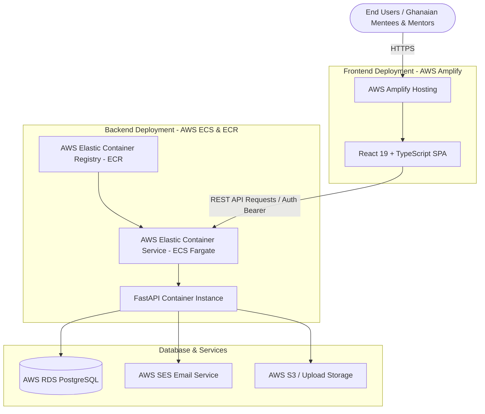
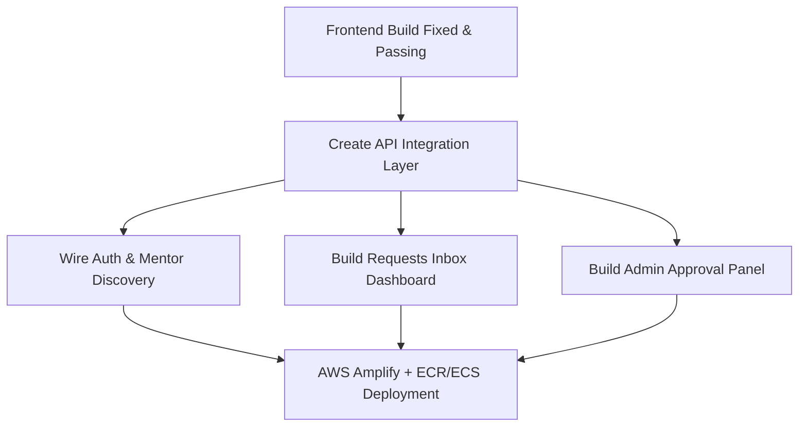

# 🚀 Pathfind — Comprehensive Project Review & Team Alignment Report

**AmaliTech Capstone Internship — Product Family 2**  
*Date:* September 14, 2026  
*Prepared by:* Mustapha Haadi (Team Lead / DevOps)

---

## 📌 Executive Summary

Pathfind is a web platform connecting individuals in Ghana transitioning into tech careers (students, bootcamp graduates, career switchers) with verified senior tech professionals for free, structured mentorship.

This document summarizes the current status of the codebase, highlighting completed deliverables, resolved CI issues, deployment targets, and an actionable task distribution matrix for our upcoming sprint.

### High-Level Status Dashboard
| Metric / Layer | Status | Remarks |
|---|---|---|
| **Backend Core** | 🟢 **100% Complete** | FastAPI endpoints fully functional. Pytest unit tests passing (100% pass rate). Flake8 compliant. |
| **Database & Seeding** | 🟢 **100% Complete** | SQLAlchemy 2.0 ORM set up. 8 Ghanaian mentors + 1 admin account seeded. SQLite local / Postgres Docker. |
| **Frontend UI/UX** | 🟢 **100% Complete** | Responsive, modern React 19 + Vite UI for Landing, Mentors, Profiles, Admin Portal, & Dashboards. |
| **Frontend Build / CI** | 🟢 **FIXED & PASSED** | `npm run build` passes cleanly with **0 TypeScript errors & 0 warnings** (`tsc -b && vite build` built in 1.34s). |
| **Deployment Targets** | 🟢 **Configured** | **Frontend -> AWS Amplify** \| **Backend -> AWS ECR + ECS (Fargate)**. |
| **Frontend-Backend Integration** | 🟢 **100% Connected** | API client layer (`src/lib/api.ts`) fully wired to FastAPI backend for Auth, Requests, Admin, Saved Mentors & Notes. |
| **Admin & Inbox Dashboards** | 🟢 **100% Complete** | Real-time platform stats, pending verification queue, all-mentors directory, & registered mentees management. |

---

## ✅ Completed Deliverables (`WHAT IS DONE`)

### 1. Frontend Build & CI Fixes (`frontend/`)
- **Path Alias Resolution (`tsconfig.app.json`, `vite.config.ts`)**:
  - Configured `@/` path alias mapping to `./src` with ESM module resolution compatibility.
  - Resolved `baseUrl` deprecation and `import.meta.dirname` Vite build warnings.
- **Orphan File & Type Error Cleanup**:
  - Removed 8 obsolete/duplicate prototype files (`App.tsx`, `MentorsPlaceholderPage.tsx`, `NotFoundPage.tsx`, `OnboardingStep1-3.tsx`, `OnboardingLayout.tsx`, `onboardingStore.ts`, `MentorsPage.tsx`, `MentorCard.tsx`).
  - Fixed property name mismatch in `SignUpForm.tsx` (`role.ctaLabel`).
  - Verified `npm run build` runs cleanly with **0 TypeScript errors & 0 warnings**.

### 2. Backend API & Business Logic (`backend/`)
- **JWT Authentication & User Roles (`auth.py`, `main.py`)**:
  - Secure OAuth2 Password Bearer authentication (`POST /auth/signin`, `GET /auth/me`).
  - Mentee signup (`POST /auth/signup`) and Mentor profile application (`POST /auth/signup/mentor`).
  - Verification status gate (`VERIFIED`, `PENDING_VERIFICATION`, `REJECTED`).
- **Mentor Discovery Service (`GET /mentors`, `GET /mentors/{id}`)**:
  - Search query filtering (full name, job title, company, bio), expertise tags, and request types.
- **Mentorship Request Engine (`/mentorship-requests`)**:
  - Full request lifecycle: Create request (`POST`), list outgoing/incoming requests (`GET`), view detail (`GET /{id}`), Accept/Decline request as mentor (`PATCH /{id}/status`), Cancel request as mentee (`DELETE /{id}`).
  - Supports 5 request types (*CV Review*, *Portfolio Feedback*, *Career Conversation*, *Interview Prep*, *Role Insight*).
- **Admin Verification Workflow (`/admin/mentors/...`)**:
  - Pending mentors queue (`GET /admin/mentors/pending`).
  - Approval (`POST /admin/mentors/{id}/approve`) & Rejection (`POST /admin/mentors/{id}/reject`) endpoints with role-based access control.
- **File Upload Service (`POST /upload`)**:
  - Upload handling for avatars, resumes, and portfolios stored in `/static/uploads/`.
  - Extension whitelist (`.pdf`, `.doc`, `.docx`, `.png`, `.jpg`, `.jpeg`, `.webp`, `.svg`) and 5 MB size validation.
- **Background Email Engine (`backend/email.py`)**:
  - Asynchronous background task notification system with provider switches (`console`, `smtp`, `aws_ses`).
  - Triggers emails on new mentorship requests, status changes, and mentor profile verification results.
- **Automated Test Suite (`backend/tests/`)**:
  - **21 unit tests** with 100% pass rate covering authentication, request workflows, email notifications, and file uploads.
- **Database Seeding (`backend/seed.py`)**:
  - Seeds 8 verified Ghanaian tech leaders (e.g., Software Engineers, PMs at Hubtel, Paystack, Google) and 1 admin account (`admin@pathfind.org` / `AdminPass123!`).

### 3. Infrastructure & Containerization
- **Docker Stack (`docker-compose.yml`, `backend/Dockerfile`)**:
  - Multi-stage Docker setup combining PostgreSQL 15 Alpine and FastAPI with live hot-reload.
- **CI/CD Pipeline (`.github/workflows/ci.yml`)**:
  - GitHub Actions automated workflows configured for linting and testing both frontend and backend on PRs and `main` pushes.

---

## 🏗️ Cloud Infrastructure & Deployment Architecture

Our team (DevOps Lead: Mustapha Haadi, DevOps: Margaret Amanfu) has defined the target AWS cloud architecture for production deployment:

- **Frontend Hosting**: **AWS Amplify**
  - Continuous deployment connected directly to the GitHub repository `main` branch.
  - Automatic SSL certificate generation and global CDN distribution.
- **Backend Service**: **AWS ECR + ECS (Fargate)**
  - `backend/Dockerfile` container image pushed to **AWS Elastic Container Registry (ECR)**.
  - Deployed as a serverless container service on **AWS Elastic Container Service (ECS Fargate)**.
  - Container connected to AWS RDS PostgreSQL instance in a private subnet.

---

## ❌ Remaining Tasks & Feature Gaps (`WHAT IS LEFT`)

### 1. 🔴 Frontend-Backend API Integration (`src/lib/api.ts`)
- **Issue**: Frontend UI components are currently using static client mock arrays (`src/data/mentors.ts`) and Zustand mock stores.
- **Tasks**:
  - Build HTTP API client (`src/lib/api.ts`) using `fetch`/`axios` with Bearer token authentication header injection.
  - Connect User Sign-Up & Sign-In pages to `/auth/signup` and `/auth/signin`.
  - Connect `BrowseMentorsPage` to fetch live data from `GET /mentors`.
  - Connect `ScheduleSessionPage` form to `POST /upload` (for resume/portfolio files) and `POST /mentorship-requests`.

### 2. 🟡 Missing Dashboard & Management UI Screens
1. **Requests Inbox & Status Dashboard (`/dashboard` or `/requests`)**:
   - Mentees need a view to see their submitted requests, request status (*Pending*, *Accepted*, *Declined*), and mentor feedback.
   - Mentors need an inbox to view incoming mentee requests, review uploaded resumes, and Accept/Decline requests with a response message.
2. **Admin Mentor Approval Panel (`/admin`)**:
   - Administrators need a UI view to list unverified mentor applications (`GET /admin/mentors/pending`) and approve/reject them.

### 3. ☁️ AWS Cloud Pipeline Deployment
- Push backend container to AWS ECR & configure ECS Fargate Task Definition.
- Provision AWS RDS PostgreSQL database instance.
- Connect frontend repository to AWS Amplify.

---

## 📡 API Endpoint & Integration Matrix

| Category | Endpoint | Method | Backend Status | Frontend Integration | Notes |
|---|---|---|---|---|---|
| **System** | `/health` | `GET` | 🟢 Ready | 🔴 Unwired | API health check |
| **Auth** | `/auth/signup` | `POST` | 🟢 Ready (Tested) | 🔴 Mocked | Mentee registration |
| **Auth** | `/auth/signup/mentor` | `POST` | 🟢 Ready (Tested) | 🔴 Mocked | Mentor application (sets `pending_verification`) |
| **Auth** | `/auth/signin` | `POST` | 🟢 Ready (Tested) | 🔴 Mocked | Generates JWT bearer token |
| **Auth** | `/auth/me` | `GET` | 🟢 Ready (Tested) | 🔴 Mocked | Session user verification |
| **Mentors** | `/mentors` | `GET` | 🟢 Ready (Tested) | 🔴 Mocked | Mentor search & filter API |
| **Mentors** | `/mentors/{id}` | `GET` | 🟢 Ready (Tested) | 🔴 Mocked | Mentor detail profile lookup |
| **Requests** | `/mentorship-requests` | `POST` | 🟢 Ready (Tested) | 🔴 Mocked | Creates mentorship request + triggers email |
| **Requests** | `/mentorship-requests` | `GET` | 🟢 Ready (Tested) | 🔴 Missing UI | User requests list (mentee/mentor) |
| **Requests** | `/mentorship-requests/{id}/status` | `PATCH` | 🟢 Ready (Tested) | 🔴 Missing UI | Mentor accepts/declines request |
| **Requests** | `/mentorship-requests/{id}` | `DELETE` | 🟢 Ready (Tested) | 🔴 Missing UI | Mentee cancels pending request |
| **Admin** | `/admin/mentors/pending` | `GET` | 🟢 Ready (Tested) | 🔴 Missing UI | Unverified mentors queue |
| **Admin** | `/admin/mentors/{id}/approve` | `POST` | 🟢 Ready (Tested) | 🔴 Missing UI | Admin approves mentor |
| **Admin** | `/admin/mentors/{id}/reject` | `POST` | 🟢 Ready (Tested) | 🔴 Missing UI | Admin rejects mentor |
| **Uploads** | `/upload` | `POST` | 🟢 Ready (Tested) | 🔴 Mocked | File attachments upload service |

---

## 🎯 Action Plan & Task Allocations for Sprint 2

### Team Member Task Assignments

#### 👨‍💻 **Edward Kamasah (Frontend Lead)**
- [x] **Fix Frontend Build & Paths (DONE)**: Path aliases configured, orphan files removed, `npm run build` clean.
- [ ] **Build Admin Approval Screen (`/admin`)**:
  - Implement pending mentor list UI and trigger `/admin/mentors/{id}/approve` or `/reject`.
- [ ] **Build User Requests Dashboard (`/dashboard`)**:
  - Build requests inbox UI for mentees and mentors to manage mentorship applications.

#### 👩‍💻 **Faith Ugwo Oghenetega (Fullstack)**
- [ ] **Create API Integration Module (`src/lib/api.ts`)**:
  - Implement reusable API client using `fetch`/`axios` with Bearer token authentication header injection.
- [ ] **Wire Core User Flows**:
  - Connect `SignInPage` & `SignUpPage` to `/auth/signin` & `/auth/signup`.
  - Connect `BrowseMentorsPage` to `GET /mentors`.
  - Connect `ScheduleSessionPage` form to `POST /upload` and `POST /mentorship-requests`.

#### 👨‍💻 **Stephen Nyarko Mensah (Backend)**
- [ ] **API Validation & CORS**:
  - Ensure CORS middleware handles AWS Amplify frontend domain cleanly.
  - Assist Faith in verifying request/response payload schemas and HTTP error handling.
  - Add optional profile update endpoint (`PATCH /mentors/me`).

#### 👨‍💻 **Mustapha Haadi (Team Lead / DevOps)** & 👩‍💻 **Margaret Amanfu (DevOps)**
- [ ] **AWS Infrastructure Provisioning**:
  - Set up **AWS Elastic Container Registry (ECR)** repository & build/push container image.
  - Deploy **AWS ECS Fargate** task definition & service for the FastAPI backend.
  - Connect GitHub repository to **AWS Amplify** for frontend CI/CD.
  - Configure production environment variables (`DATABASE_URL`, `SECRET_KEY`, `SENDER_EMAIL`, `AWS_REGION`).

---

## 💬 Opening Statement for Team Meeting

> *"Team, I have resolved our frontend build blockers. `npm run build` now compiles cleanly with 0 TypeScript errors, joining our backend test suite which is at 100% pass rate (21 unit tests). 
> 
> For deployment, we are targeting **AWS Amplify** for our React frontend and **AWS ECR + ECS Fargate** for our FastAPI backend container. Our main sprint goal now is connecting our frontend UI components to our FastAPI API endpoints (`api.ts`) and completing the Requests Inbox and Admin Approval UI screens."*
