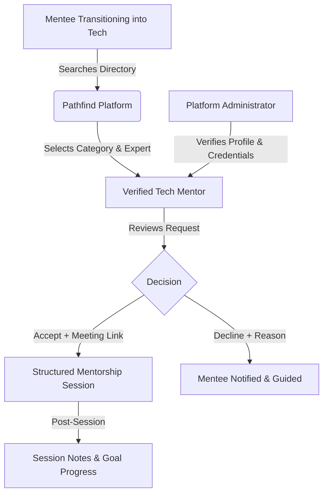
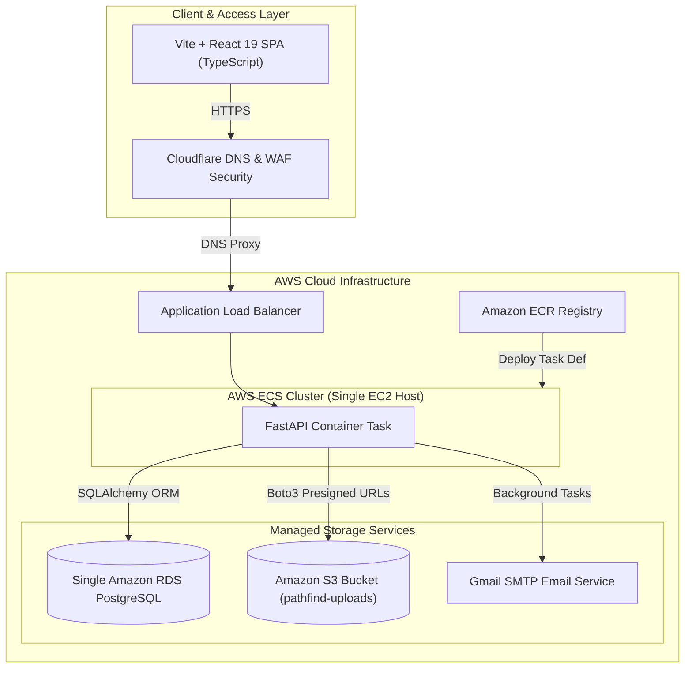
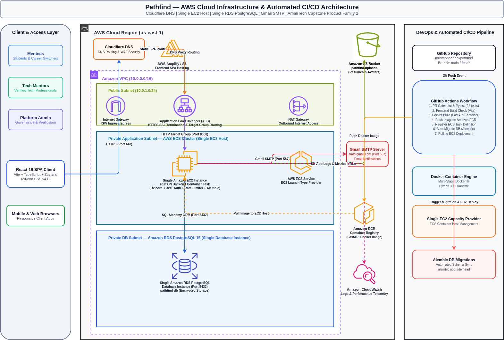
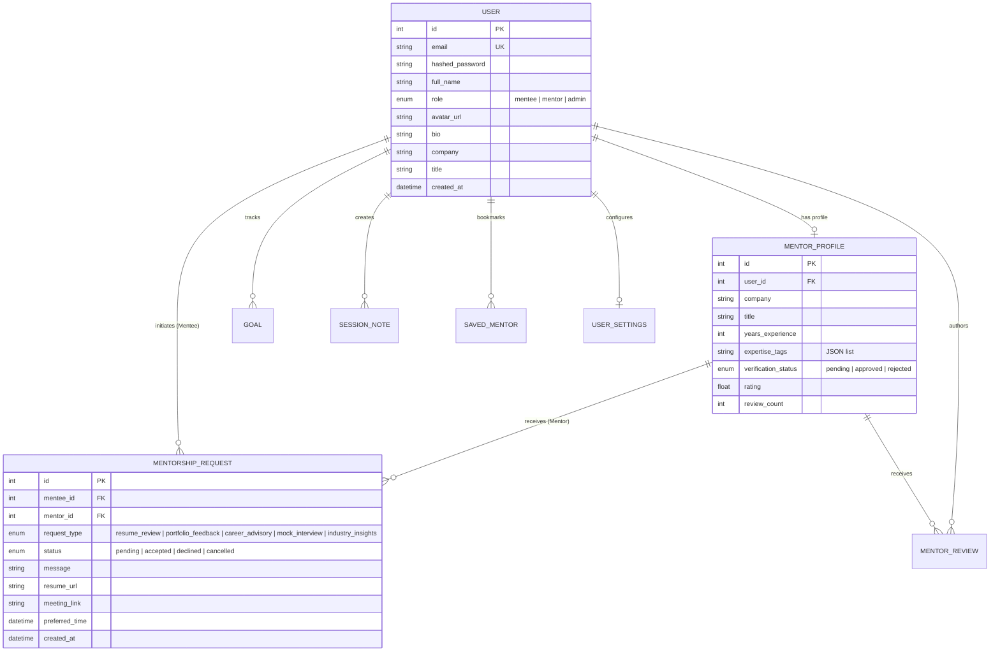
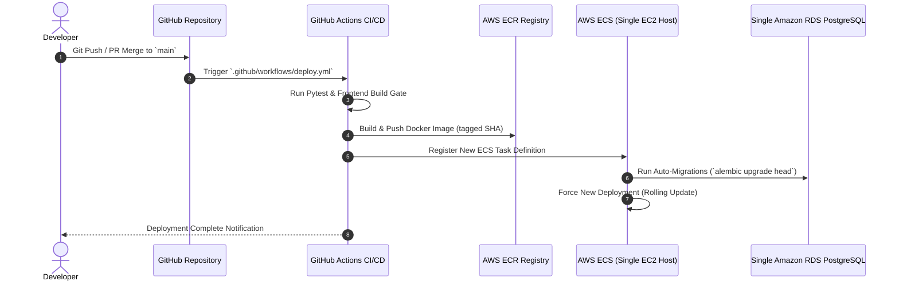

# Pathfind — Comprehensive Project Report
**AmaliTech Capstone Internship — Product Family 2**  
**Document Version:** 1.2.0  
**Date:** September 2026  
**Repository:** `mustaphahaadi/pathfind`

---

> [!NOTE]
> **SCREENSHOT PLACEHOLDER #1: Project Title & Production Hero Banner**
> *Capture a high-resolution screenshot of the Pathfind live landing page hero section showing header navigation, CTA buttons, and platform taglines.*

---

## Executive Summary

**Pathfind** is an end-to-end web platform designed to bridge the career entry gap for aspiring tech professionals in Ghana—including university students, recent graduates, coding bootcamp alumni, and self-taught career switchers. By providing a structured, transparent, and user-friendly ecosystem, Pathfind connects mentees with verified, experienced industry professionals for targeted, high-impact career guidance.

Developed as the flagship capstone project for **Product Family 2** during the **AmaliTech Capstone Internship**, Pathfind addresses the structural mismatch between academic tech training and industry readiness. Mentees can search an annotated directory of verified tech mentors, submit structured mentorship requests across specialized categories (Resume Review, Portfolio Feedback, Career Path Advisory, Mock Interviews, Role/Industry Insights), maintain private session notes, track career goals, and bookmark top mentors.

Administrators maintain platform integrity via a dedicated control center featuring real-time telemetry, user management, and a mentor verification workflow. Built on a modern tech stack (FastAPI, React 19, TypeScript, PostgreSQL, AWS ECS EC2/S3, Gmail SMTP, Docker, GitHub Actions), Pathfind achieves enterprise-grade security, scalability, and developer ergonomics.

---

## 1. Project Vision & Core Requirements

### 1.1 Background & Problem Statement
In emerging tech hubs across West Africa, ambitious individuals face several challenges:
1. **Information Asymmetry**: Transitioning individuals lack clear insights into industry expectations, actual hiring standards, and effective portfolio construction.
2. **Access Barrier**: Direct access to senior software engineers, DevOps specialists, data scientists, and product designers is often restricted to informal professional networks.
3. **Unstructured Mentorship**: Informal outreach on general social networks frequently leads to ghosting, unfocused conversations, or unfulfilled expectations due to a lack of explicit scope.

### 1.2 The Pathfind Solution
Pathfind introduces a structured model where mentorship interactions are bound to specific categories, scheduled meetings, and trackable outcomes.



### 1.3 Key Objectives & Value Propositions
- **For Mentees**: Instant access to vetted industry mentors, transparent expertise tagging, category-based request scheduling, personalized goal tracking, and note-taking.
- **For Mentors**: Granular control over request volume, structured intake details (resume links, goals, custom notes), direct video link insertion, and seamless status management.
- **For Administrators**: Centralized governance, automated application queuing, one-click verification/rejection, user lifecycle management, and real-time platform health metrics.

---

## 2. Product Architecture & System Design

Pathfind utilizes a decoupled, cloud-native architecture optimized for containerized deployment on **AWS ECS (EC2 Launch Type)** with a single EC2 container host, single RDS PostgreSQL database, and Cloudflare DNS routing.





> [!NOTE]
> **SCREENSHOT PLACEHOLDER #2: Overall System & AWS Infrastructure Diagram**
> *The production architecture diagram above highlights Cloudflare DNS, the Application Load Balancer, the single EC2 container instance host, single RDS PostgreSQL database instance, S3 uploads bucket, and Gmail SMTP service.*

### 2.1 Technology Stack Rationale

| Architectural Layer | Technology | Decision Rationale & Key Features |
| :--- | :--- | :--- |
| **Frontend Framework** | React 19 + TypeScript | High render performance, strict compile-time type safety, component modularity. |
| **Build System & Tooling** | Vite 8 | Fast HMR (Hot Module Replacement), optimized roll-up production bundling. |
| **Styling & UI Design** | Tailwind CSS v4 | Utility-first design, built-in design tokens, zero-runtime CSS footprint. |
| **State & Navigation** | Zustand + React Router v7 | Lightweight, boilerplate-free state management with built-in state persistence. |
| **Backend API Framework** | Python 3.11 + FastAPI 0.95 | Async native execution, OpenAPI/Swagger generation, Pydantic type validation. |
| **ORM & Database** | SQLAlchemy 2.0 + PostgreSQL 15 | Single RDS PostgreSQL instance, robust relational modeling, ACID compliance. |
| **Email Service** | Gmail SMTP Server | Fast, reliable transactional notification emails via `smtp.gmail.com`. |
| **Schema Migrations** | Alembic | Version-controlled, declarative database migrations integrated into CI/CD. |
| **File Storage** | AWS S3 + Local Fallback | High-durability blob storage with presigned URLs and local dev fallback. |
| **Containerization & Deployment** | Docker + AWS ECS (EC2) | Single EC2 container host execution, automated zero-downtime rolling deploys. |

---

## 3. Database Architecture & Data Schema

Pathfind relies on a relational database design enforced via SQLAlchemy ORM models ([`backend/models.py`](file:///home/haadi/Desktop/AmaliTech/AVI/pathfind/backend/models.py)).

### 3.1 Entity Relationship Diagram



> [!NOTE]
> **SCREENSHOT PLACEHOLDER #3: Database Schema / DBeaver / PGAdmin Overview**
> *Capture a view of the PostgreSQL database tables and relationships in PGAdmin, DBeaver, or via psql terminal output.*

### 3.2 Detailed Data Dictionary

#### 1. `users` Table
- **`id`** (`INTEGER`, PK): Unique auto-incrementing user identifier.
- **`email`** (`VARCHAR(255)`, Unique, Indexed): User email address used for sign-in.
- **`hashed_password`** (`VARCHAR(255)`): Bcrypt-hashed password string.
- **`full_name`** (`VARCHAR(100)`): Display name of the user.
- **`role`** (`ENUM('mentee', 'mentor', 'admin')`): System access level.
- **`avatar_url`** (`VARCHAR(500)`): URL path to user profile image (S3 or static upload).

#### 2. `mentor_profiles` Table
- **`id`** (`INTEGER`, PK): Unique mentor profile identifier.
- **`user_id`** (`INTEGER`, FK -> `users.id`): Associated user account.
- **`company`** (`VARCHAR(100)`): Current employer or organization.
- **`title`** (`VARCHAR(100)`): Current professional designation.
- **`years_experience`** (`INTEGER`): Total years in tech.
- **`expertise_tags`** (`TEXT`): Serialized JSON list of skills (e.g., `["React", "DevOps", "Python"]`).
- **`verification_status`** (`ENUM('pending', 'approved', 'rejected')`): Admin approval state.

#### 3. `mentorship_requests` Table
- **`id`** (`INTEGER`, PK): Request tracking ID.
- **`mentee_id`** (`INTEGER`, FK -> `users.id`): Requester account.
- **`mentor_id`** (`INTEGER`, FK -> `mentor_profiles.id`): Target mentor profile.
- **`request_type`** (`ENUM`): Category of mentorship requested.
- **`status`** (`ENUM('pending', 'accepted', 'declined', 'cancelled')`): Operational state.
- **`meeting_link`** (`VARCHAR(500)`): Meeting URL attached by mentor upon acceptance.

---

## 4. Backend Engineering & API Specifications

The backend service is structured using FastAPI ([`backend/main.py`](file:///home/haadi/Desktop/AmaliTech/AVI/pathfind/backend/main.py)).

> [!NOTE]
> **SCREENSHOT PLACEHOLDER #4: Interactive OpenAPI (Swagger UI) Documentation**
> *Take a full-page screenshot of `http://localhost:8000/docs` showing endpoint tags (`/auth`, `/mentors`, `/mentorship-requests`, `/admin`).*

### 4.1 Key Endpoints Summary

| HTTP Method | Route Endpoint | Target Role | Functional Summary |
| :--- | :--- | :--- | :--- |
| `POST` | `/auth/signup` | Public | Registers a new Mentee account. |
| `POST` | `/auth/signup/mentor` | Public | Submits a Mentor application with verification queue placement. |
| `POST` | `/auth/signin` | Public | Authenticates credentials, returning JWT bearer token. |
| `GET` | `/auth/me` | Authenticated | Retrieves current authenticated profile & identity context. |
| `GET` | `/mentors` | Public | Searches and filters verified mentors by topic, tag, or experience. |
| `POST` | `/mentorship-requests` | Mentee | Submits a structured mentorship booking request. |
| `PATCH` | `/mentorship-requests/{id}/status` | Mentor | Updates request status (`accepted`/`declined`) and sets `meeting_link`. |
| `GET` | `/admin/stats` | Admin | Provides system analytics (user breakdown, pending verification count). |
| `POST` | `/admin/mentors/{id}/approve` | Admin | Approves a pending mentor profile and sends Gmail SMTP email notification. |
| `POST` | `/upload` | Authenticated | Validates and stores user files (max 5MB, S3 presigned or local disk). |

### 4.2 Security & File Storage Implementation
- **JWT Auth & Password Hashing**: Passwords are encrypted using `passlib` with `bcrypt`. JWT tokens encode user ID and role with standard expiration windows.
- **Rate Limiting**: Integrated `slowapi` rate limiters protect authentication routes (`/auth/signup` limited to 3 requests/min, `/auth/signin` to 5 requests/min) to prevent brute-force attacks.
- **S3 Storage Abstraction**: [`backend/s3_service.py`](file:///home/haadi/Desktop/AmaliTech/AVI/pathfind/backend/s3_service.py) handles file uploads using `boto3`. If S3 credentials or bucket settings are unavailable, the service automatically falls back to local storage (`backend/static/uploads/`).

---

## 5. Frontend Design & User Experience

The frontend application provides a responsive experience across mobile, tablet, and desktop devices.

> [!NOTE]
> **SCREENSHOT PLACEHOLDER #5: Mentee Dashboard & Starter Goals Widget**
> *Capture the Mentee Home Dashboard displaying active mentorship requests, starter goals, and session quick links.*

> [!NOTE]
> **SCREENSHOT PLACEHOLDER #6: Mentor Directory & Filtering Interface**
> *Capture the `/mentors` page showing search inputs, skill tag filters, and mentor cards with avatar images.*

> [!NOTE]
> **SCREENSHOT PLACEHOLDER #7: Mentorship Request Modal with Meeting Link**
> *Capture the Request Modal open on a mentor profile, showing category selection, message text area, and resume link input.*

> [!NOTE]
> **SCREENSHOT PLACEHOLDER #8: Mentor Request Acceptance Modal with Video Link Input**
> *Capture the Mentor Dashboard modal where a mentor accepts a request and inputs a Google Meet / Zoom link.*

> [!NOTE]
> **SCREENSHOT PLACEHOLDER #9: Admin Telemetry & Mentor Verification Queue**
> *Capture the `/admin` control panel displaying system stats cards and the pending mentor approval table.*

### 5.1 Route Guarding & Navigation Security
The application uses React Router v7 with dedicated higher-order guard components ([`frontend/src/routes/guards/AuthGuards.tsx`](file:///home/haadi/Desktop/AmaliTech/AVI/pathfind/frontend/src/routes/guards/AuthGuards.tsx)):
- **`ProtectedRoute`**: Restricts access to authenticated users.
- **`GuestOnlyRoute`**: Prevents logged-in users from accessing signin/signup routes.
- **`MentorRoute`**: Restricts mentor dashboard routes exclusively to approved mentor accounts.
- **`AdminRoute`**: Protects administrator analytics and control panels.

---

## 6. DevOps, AWS Infrastructure & CI/CD Pipeline

Pathfind features an automated deployment pipeline using **GitHub Actions**, **Amazon ECR**, **AWS ECS (EC2 Launch Type)**, **Single EC2 Container Host**, **Single Amazon RDS Instance**, and **Gmail SMTP**.



> [!NOTE]
> **SCREENSHOT PLACEHOLDER #10: GitHub Actions Successful Deployment Workflow**
> *Capture a screenshot of the GitHub Actions UI showing successful execution of the build and deploy jobs.*

> [!NOTE]
> **SCREENSHOT PLACEHOLDER #11: AWS ECS Console & EC2 Container Instance**
> *Capture the AWS ECS Console displaying the active `pathfind-cluster` and healthy running single EC2 container task.*

> [!NOTE]
> **SCREENSHOT PLACEHOLDER #12: Amazon ECR Container Repository**
> *Capture the Amazon ECR Repository console showing pushed container image tags with commit SHAs.*

> [!NOTE]
> **SCREENSHOT PLACEHOLDER #13: Amazon RDS Instance Details**
> *Capture the Amazon RDS Console showing the single PostgreSQL database instance status and metric graphs.*

> [!NOTE]
> **SCREENSHOT PLACEHOLDER #14: Amazon S3 Bucket Console**
> *Capture the AWS S3 Console showing the `pathfind-uploads` bucket structure and permissions.*

---

## 7. Quality Assurance & Automated Verification

The codebase includes automated test suites covering backend functionality and frontend builds.

### 7.1 Backend Test Results (`pytest`)
All 22 backend test cases executed cleanly with 100% pass rates across critical application workflows:

```text
============================= test session starts ==============================
platform linux -- Python 3.14.4, pytest-8.3.5
rootdir: /home/haadi/Desktop/AmaliTech/AVI/pathfind/backend
collected 22 items

tests/test_auth.py .................                                      [ 31%]
tests/test_email.py ....                                                 [ 50%]
tests/test_mentorship_requests.py ......                                 [ 77%]
tests/test_upload.py .....                                               [100%]

======================= 22 passed in 53.18s =======================
```

> [!NOTE]
> **SCREENSHOT PLACEHOLDER #15: Pytest Suite Execution Terminal Output**
> *Capture a terminal window showing the clean execution of `pytest backend/tests` with 22 passed tests.*

### 7.2 Frontend Production Build Verification
The frontend passes TypeScript checks and builds an optimized production bundle:

```text
✓ 1951 modules transformed.
dist/index.html                             0.99 kB │ gzip:  0.50 kB
dist/assets/index-BU0Ig4I6.css             69.61 kB │ gzip: 11.39 kB
dist/assets/vendor-Bmq6uX83.js            277.37 kB │ gzip: 88.40 kB
dist/assets/index-CEBZn1Jn.js             321.58 kB │ gzip: 66.93 kB
✓ built in 5.87s
```

> [!NOTE]
> **SCREENSHOT PLACEHOLDER #16: Frontend Production Build & ESLint Terminal Output**
> *Capture terminal execution of `npm run build` and `npm run lint` showing zero errors.*

---

## 8. Master Index of Screenshot Placeholders

To finalize this report for publication or executive submission, take screenshots for each placeholder below and replace the callout blocks with standard image markdown syntax: ``.

| Placeholder ID | Target Component / Screen | Recommended Source | Description / Context |
| :---: | :--- | :--- | :--- |
| **#1** | Landing Page Hero | Live Production App / Local Dev | Header navigation, primary CTA, branding elements. |
| **#2** | System Architecture | Architecture Visual / AWS Console | Overview of Cloud Infrastructure services. |
| **#3** | Database Tables | PGAdmin / DBeaver / psql | Tables, foreign key relations, constraints. |
| **#4** | OpenAPI Documentation | Swagger UI (`/docs`) | FastAPI endpoints, schema definitions. |
| **#5** | Mentee Dashboard | Live Application (`/dashboard`) | Request list, starter goals widget, session notes. |
| **#6** | Mentor Directory | Live Application (`/mentors`) | Search bar, tag filter buttons, mentor cards. |
| **#7** | Request Booking Modal | Live Application | Booking modal form with category dropdown & resume URL. |
| **#8** | Mentor Accept Modal | Live Application | Acceptance modal with video meeting link entry. |
| **#9** | Admin Control Panel | Live Application (`/admin`) | Platform metrics, pending mentor verification queue. |
| **#10** | GitHub Actions Pipeline | GitHub Actions UI | Workflow status for CI/CD run. |
| **#11** | AWS ECS Console | AWS ECS Management Console | Cluster view, task definitions, running single EC2 container task. |
| **#12** | AWS ECR Repository | AWS ECR Console | Docker image tags and repository metadata. |
| **#13** | Amazon RDS Console | AWS RDS Console | Database health, CPU utilization, connections graph. |
| **#14** | Amazon S3 Console | AWS S3 Console | Bucket file structure and public/presigned access config. |
| **#15** | Pytest Test Suite | Terminal Command Line | Output showing 22/22 tests passed. |
| **#16** | Frontend Build & Lint | Terminal Command Line | Output showing clean TypeScript compilation & Vite bundle size. |

---

## 9. Team & Project Leadership — Product Family 2

| Name | Primary Project Role | Core Responsibilities & Focus Areas |
| :--- | :--- | :--- |
| **Mustapha Haadi** | **DevOps / Cloud, Team Lead** | AWS ECS EC2/ECR/RDS Infrastructure, Cloudflare DNS, CI/CD Pipelines, S3 Storage & Release Management. |
| **Edward Kamasah** | **Frontend Engineer** | React 19 UI Architecture, Component Library, State Stores, responsive layout design. |
| **Faith Ugwo Oghenetega** | **Fullstack Engineer** | API integration, Mentorship request workflows, Goal tracking, Modal interfaces. |
| **Margaret Amanfu** | **DevOps Engineer** | Docker containerization, Environment configuration, Deployment documentation. |
| **Stephen Nyarko Mensah** | **Backend Engineer** | FastAPI endpoints, SQLAlchemy ORM modeling, Database seed scripts, Authentication logic. |

---

*Report prepared by Product Family 2 for the AmaliTech Capstone Internship Program.*
